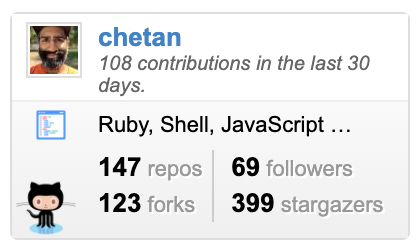

# go go github badge

A golang port of [github-badge](https://github.com/berkerpeksag/github-badge).
That version is written in python2 and targets Google App Engine.

In order to remove the dependency on GAE and run it in cleanly in a container,
I made this port. It's functionality is almost identical with a few operational
changes and the removal of the activity sparkline graph.

## License

`*.go`: [MIT](./LICENSE), (c) 2021 Chetan Sarva

`*.html (including css, images)`: [MPL 2.0](http://mozilla.org/MPL/2.0/)
